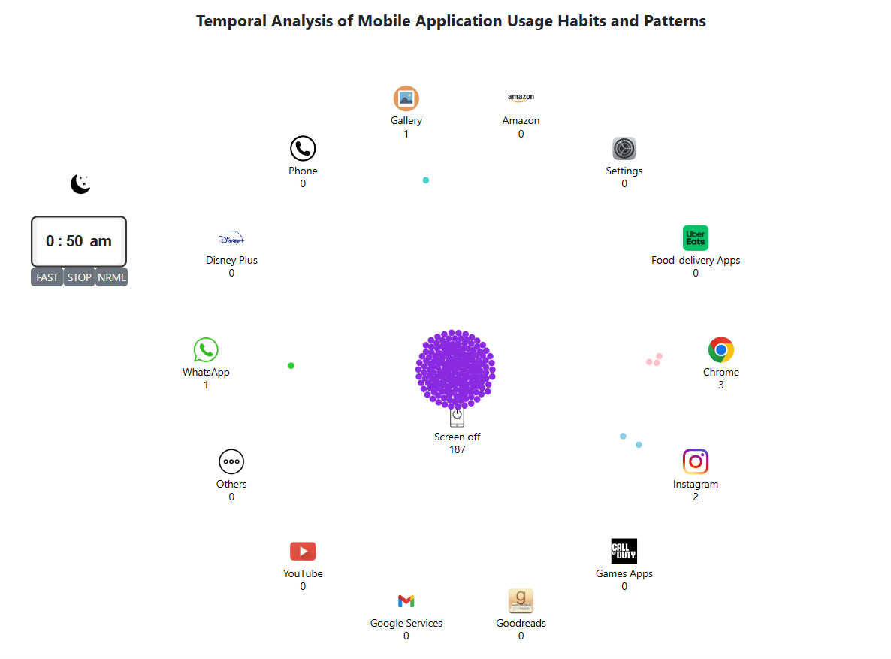
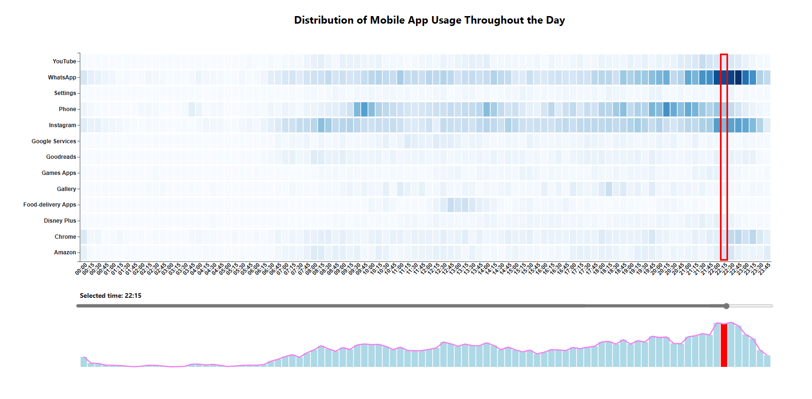
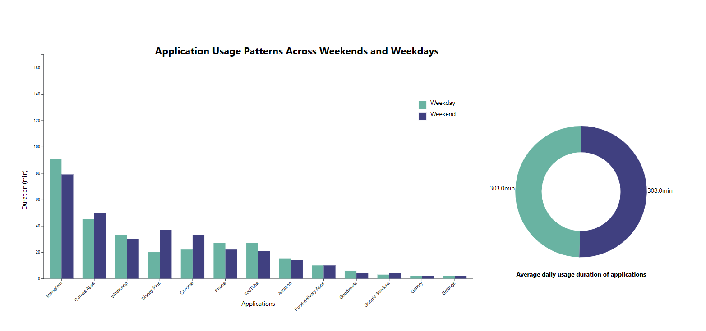
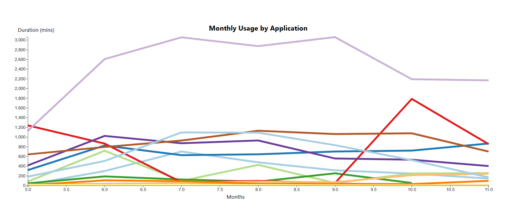

# Analyse des Habitudes d'Utilisation des Applications Mobiles

## 0. Theme of this project

This project focuses on exploring the habit of phone usages (including phone's applications, duration of using, ...). It comprises four main visualizations, each providing distinct insights into mobile app usage patterns. The first visualization employs a bubblechart to dynamically show the temporal evolution of app usage, with an interactive clock feature for enhanced user experience. The second visualization features a heatmap, allowing users to explore app usage trends over time using a slider and connected barchart to detect picks. The third visualization conducts a comparative analysis of app usage between weekdays and weekends, revealing distinct preferences for different types of apps during these periods. Finally, the fourth visualization,  offers a comprehensive overview of monthly app usage patterns over a 7-month period. Instagram emerges as the consistently most used app, followed by WhatsApp, YouTube, and phone calls. Notably, gaming app usage peaks in May and June, experiencing a decline until September, possibly linked to summer vacations. 

## 1. Data preparation

### 1.1 Source of data
https://www.kaggle.com/datasets/arul08/mobile-usage-dataset-individual-person/data
https://abardou.github.io/viz-habits/#/visualisation 

### 1.2 Process the data:
- Using Python 

"""
conda create --name M2_DataViz python=3.8

conda activate M2_DataViz

pip install -r requirements.txt

"""
## 2. Visualization with D3

### 2.1 Bubles clusterings (Tutorials on bubles clusterings, code available)

https://gist.github.com/mbostock/7881887

### 2.2 A day in American life (ideas, no code available)

https://flowingdata.com/2015/12/15/a-day-in-the-life-of-americans/
https://abardou.github.io/viz-habits/#/visualisation

### 2.3 D3 force documentations (Extremely useful)

https://d3js.org/d3-force

### 2.4 Stackoverflow (Different types of bugs regarding d3)

## 3. Overview of the Work

